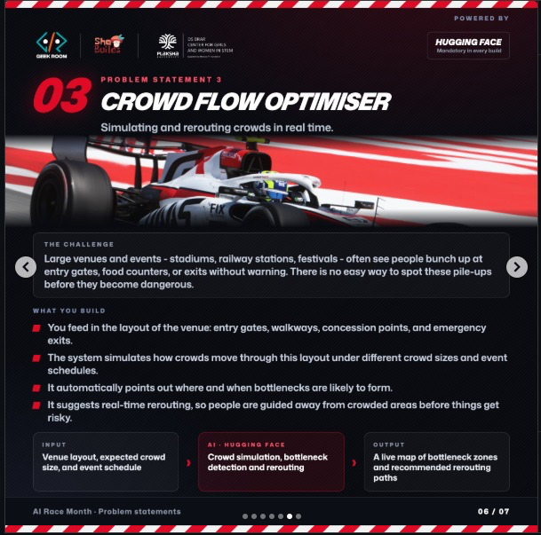

# Crowd Flow Optimiser

Simulating and rerouting crowds in real time.

Problem Statement 03, AI Race Month.



## The challenge

Large venues and events, stadiums, railway stations, festivals, often see people bunch up at entry gates, food counters, or exits without warning. There is no easy way to spot these pile-ups before they become dangerous.

## What we build

- You feed in the layout of the venue: entry gates, walkways, concession points, and emergency exits.
- The system simulates how crowds move through this layout under different crowd sizes and event schedules.
- It automatically points out where and when bottlenecks are likely to form.
- It suggests real-time rerouting, so people are guided away from crowded areas before things get risky.

| | |
|---|---|
| **Input** | Venue layout, expected crowd size, and event schedule |
| **Model** | Crowd simulation, bottleneck detection and rerouting |
| **Output** | A live map of bottleneck zones and recommended rerouting paths |

## This repository

An MVP that takes an F1 circuit as the venue. Every figure on screen comes from a built-in crowd simulation: camera, Wi-Fi and turnstile feeds are mocked, so the whole control room runs without any live infrastructure.

| Screen | What it does |
|---|---|
| Live Map | Circuit map with a crowd-density heatmap, per-zone head counts and live bottleneck list |
| Zones | Every zone with capacity, occupancy and dwell time |
| Alerts | Bottlenecks ranked by severity with time to clear |
| Rerouting | Suggested alternative paths away from congested zones |
| Simulation | Clock controls: pause, skip ahead, reset, and 1x to 10x speed |
| Evacuation | Emergency exit routing and clearance estimates |
| Copilot | Natural-language questions about the current crowd state |
| Spectator | The attendee-facing view of a recommended route |
| Feeds | Mock camera, Wi-Fi and turnstile sensor streams |
| Report | Post-event summary of density, queues and incidents |
| Layout | Tune gates, walkways, concessions and exits |
| Circuits | Switch venue: Silverstone, Monza, Monaco, Spa, Interlagos, Marina Bay |

## Development

Requires Node.js.

```sh
git clone https://github.com/pulkitxm/vmax.git
cd vmax
npm install
npm run dev
```

## Built with

- TanStack Start
- TypeScript
- React
- Tailwind CSS
